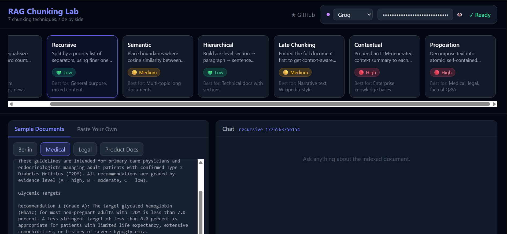

# RAG Chunking Lab

**RAG Chunking Lab** is an interactive, browser-based educational tool for exploring how seven different document chunking strategies affect retrieval quality in Retrieval-Augmented Generation (RAG) pipelines. Index a document with any technique, ask questions in a live chat, and compare two strategies side by side — all while watching exactly which chunks are retrieved and why. Built for engineers who want to build real intuition about chunking, not just read about it.



---

## What Is Chunking and Why Does It Matter

A RAG pipeline works by splitting a document into pieces, embedding those pieces into a vector space, and at query time retrieving the pieces most similar to the query. A language model then reads those retrieved pieces and generates an answer. The entire system only works well if the retrieved pieces actually contain the information the question is asking about.

**Chunking is the first design decision, and it propagates through everything else.** The embedding model, the retrieval algorithm, the context window budget, and the final answer quality all depend on how the document was split. Unlike model selection or prompt engineering, chunking choices rarely get benchmarked rigorously — most practitioners pick 512 tokens with 10% overlap and never revisit it.

The core tradeoff is straightforward but easy to underestimate: chunks that are too small lose the context that makes them interpretable; chunks that are too large dilute the embedding signal so that retrieved chunks contain a lot of irrelevant text alongside the relevant part. A chunk of 5 words is unambiguous about meaning but likely incomplete. A chunk of 2,000 words is complete but its embedding is a blurry average of everything it contains.

A concrete example: the chunk `"The dosage should not exceed this amount."` is meaningless in isolation. Without the preceding sentence — `"Metformin is contraindicated in patients with an eGFR below 30 mL/min."` — neither a human nor a language model can answer the question *"What is the Metformin dose limit?"*. This is the **dangling reference problem**, and every chunking technique in this project takes a different approach to solving it.

---

## The 7 Techniques

### 1. Fixed-Size Chunking

**Intuition:** The simplest possible strategy — split text into equal-size windows of words, sliding forward by a fixed stride. The overlap ensures that content near a boundary appears in two adjacent chunks, so queries that need context spanning a split still find it. Predictable, fast, zero dependency on embeddings or LLMs at index time. Research shows this baseline is surprisingly hard to beat.

**The Math:**
```
chunk_i = words[ i·S : i·S + W ]
where W = window size (chunk_size), S = stride = W − overlap

N = ⌈(total_words − overlap) / S⌉
```

**When to use it:** Homogeneous documents — logs, transcripts, news articles, anything without strong structural variation.
**When NOT to use it:** Structured documents where a sentence boundary is meaningless mid-paragraph.

---

### 2. Recursive / Structure-Aware Chunking

**Intuition:** Try coarse splits first (paragraph breaks), accept the result if it fits within `max_size`, and only recurse to finer splits (line breaks, sentence endings, spaces) for segments that are still too large. This respects natural language hierarchy: a section that fits in one chunk stays as one chunk; only oversized sections get split further. The overlap logic then stitches adjacent chunks together at the boundary.

**The Math:**
```
recursive_split(text, separators, max_size):
    sep = separators[0]   # try coarsest separator first
    splits = text.split(sep)
    for each split:
        if word_count(split) <= max_size:
            keep as leaf chunk
        else:
            recursive_split(split, separators[1:], max_size)

Separator priority: ["\n\n", "\n", ". ", " "]
```

**When to use it:** General-purpose — the default for any mixed-format document.
**When NOT to use it:** Highly repetitive text where no separator produces useful boundaries.

---

### 3. Semantic Chunking

**Intuition:** Embed each sentence separately and find the positions in the document where adjacent sentences become topically dissimilar. Rather than using a fixed similarity threshold (which would be document-dependent), compute a dynamic threshold from the distribution of all pairwise similarities in that document. This adapts to each document's own topical variety.

**The Math:**
```
sim(a,b) = (a · b) / (‖a‖ · ‖b‖)

threshold = μ(similarities) − k · σ(similarities)

boundary at position i  iff  sim(s_i, s_{i+1}) < threshold
```

where `k` is a tunable sensitivity parameter (default 1.0). Higher `k` → lower threshold → fewer boundaries → larger chunks.

**When to use it:** Long documents with clearly distinct topics — Wikipedia articles, research papers, multi-section reports.
**When NOT to use it:** Short or highly repetitive documents where similarity variance is too low to yield meaningful boundaries.

---

### 4. Hierarchical Chunking

**Intuition:** Preserve the document's natural hierarchy — sections contain paragraphs, paragraphs contain sentences — and index only the leaf nodes (sentences), but store the full parent context in each leaf's metadata. At retrieval time, if the question matches a sentence, you can return its full paragraph for richer context. If multiple sentences from the same paragraph are retrieved, return the paragraph once instead — this is the **Auto-Merge** pattern.

**The Structure:**
```
L1 (section)   → split on "\n\n\n"  or  "# Markdown header"
L2 (paragraph) → split on "\n\n"
L3 (sentence)  → split on [.!?] sentence boundaries

Returns: L3 chunks only.
Each chunk carries:
  metadata.paragraph_text  →  full L2 parent text
  metadata.section_text    →  full L1 grandparent text
  metadata.section_idx     →  section index (0-based)
  metadata.paragraph_idx   →  paragraph index (0-based)
```

**When to use it:** Documents with headers and clear paragraph structure — technical documentation, contracts, medical guidelines.
**When NOT to use it:** Unstructured prose where the three-level hierarchy does not exist.

---

### 5. Late Chunking

**Intuition:** Standard chunking embeds each chunk independently — the embedding for a chunk in the middle of a document has no idea what came before or after it. Late chunking inverts this: run the entire document through the embedding model first to produce token-level hidden states, then derive each chunk's embedding by mean-pooling the token vectors that fall within that chunk's span. Every token's representation already carries cross-document attention, so the chunk embedding is context-aware from the start. Designed for long-context models (Jina v2, 8192-token context window).

**The Math:**
```
Standard approach:
  embed(chunk_i) independently  →  context-blind embeddings

Late chunking:
  embed(full_doc)  →  token vectors [v_1 … v_T]
  embed(chunk_i)   =  mean_pool(v_{start_i} … v_{end_i})

  mean_pool(v_s … v_e) = (1 / (e − s + 1)) · Σ v_t   for t ∈ [s, e]
```

**When to use it:** Narrative text with heavy cross-sentence coreference — Wikipedia-style articles, books, news, anything where "it" or "they" refers back several paragraphs.
**When NOT to use it:** Documents that exceed the model's context window; self-contained technical sections where cross-chunk context is unnecessary.

---

### 6. Contextual Retrieval

**Intuition:** Many chunks are ambiguous in isolation. The sentence "the results were inconclusive" tells a retrieval system almost nothing about which results, from which study, about which hypothesis. Contextual retrieval fixes this by asking an LLM to write 1–2 sentences describing each chunk in the context of the full document, then prepending that summary to the chunk text before embedding. The embedding now represents both the content and the role.

**The Algorithm:**
```
For each chunk c:
    prompt = "Given the full document (excerpt) and this chunk,
              write 1-2 sentences describing what the chunk is about
              and where it sits in the document."
    context_summary = LLM(prompt, doc[:2000], c.text)
    embedded_text   = context_summary + "\n\n" + c.text
```

**When to use it:** Enterprise knowledge bases, long reports with many forward/backward references, any corpus where chunks are lexically ambiguous out of context.
**When NOT to use it:** High-volume indexing where LLM cost per chunk is prohibitive; documents where each chunk is already self-contained.

---

### 7. Proposition Chunking

**Intuition:** Even a well-sized chunk contains multiple facts. A query about one fact retrieves the whole chunk, which may be dominated by the other facts. Proposition chunking decomposes each paragraph into atomic, self-contained factual claims using an LLM — replacing all pronouns with named entities so each claim stands alone. Each proposition becomes one chunk. This is the most granular approach and produces the highest retrieval precision on fact-dense documents.

**The Algorithm:**
```
For each paragraph p:
    prompt = "Extract all atomic factual propositions.
              Rules:
              1. Each proposition must be a single verifiable claim.
              2. Replace all pronouns with the actual named entity.
              3. Return ONLY a JSON array of strings."
    propositions = JSON.parse(LLM(prompt, p))
    # Each proposition → one Chunk
```

**When to use it:** Medical records, legal documents, scientific papers, any domain where questions ask about specific, atomic facts.
**When NOT to use it:** Narrative or argumentative text where atomizing destroys the rhetorical structure; anywhere LLM cost or latency is a constraint.

---

## Architecture

```
┌─────────────────────────────────────────────────────┐
│                      Frontend                        │
│         React 18 + Tailwind CSS + Vite               │
│   ──────────────────────────────────────────────     │
│   APIKeyInput   TechniqueSelector (7 cards)          │
│   DocumentPanel  →  ChatInterface                    │
│   ComparisonView  │  MetricsPanel                    │
└──────────────────────┬──────────────────────────────┘
                       │ HTTP/JSON (axios)
┌──────────────────────▼──────────────────────────────┐
│                  FastAPI Backend                      │
│   POST /api/documents/index    GET /api/chunkers     │
│   POST /api/query              GET /api/documents/list│
│   POST /api/compare            GET /api/documents/   │
│                                    chunks/{name}     │
└──────┬────────────────┬─────────────────┬───────────┘
       │                │                 │
  ┌────▼─────┐    ┌─────▼──────┐   ┌─────▼──────┐
  │ Chunkers │    │ Embeddings │   │  ChromaDB  │
  │  (× 7)   │    │ MiniLM-L6  │   │ VectorStore│
  └──────────┘    └────────────┘   └────────────┘
       │
  ┌────▼──────────────┐
  │ LLM Providers     │
  │ Anthropic / OpenAI│
  │ Groq  (optional)  │
  └───────────────────┘
```

The vector store sits behind a `BaseVectorStore` abstract class — swapping ChromaDB for Qdrant or Pinecone requires only a new file in `backend/vector_store/` and one line in the factory.

---

## Quick Start

### Prerequisites
- Python 3.11+
- Node.js 18+

### Backend
```bash
cd backend
python -m venv venv
source venv/bin/activate        # Windows: venv\Scripts\activate
pip install -r requirements.txt
uvicorn main:app --reload --port 8000
```

On first start, sentence-transformers will download `all-MiniLM-L6-v2` (~90 MB) and cache it. Subsequent starts are instant.

### Frontend
```bash
cd frontend
npm install
npm run dev
```

Open **http://localhost:5173**

### Optional: LLM features

Paste your API key into the key bar at the top of the page. Supports **Anthropic**, **OpenAI**, and **Groq**. The key is never stored — it lives only in browser state for the session and is cleared on page refresh.

Techniques that **require** an API key: **Contextual Retrieval**, **Proposition Chunking**.
All other five techniques work fully offline.

---

## How to Use It

1. **Pick a technique** — click one of the 7 cards. Read the description and cost badge.
2. **Select a document** — choose one of the 4 bundled samples or paste your own text.
3. **Click "Index Document"** — the backend chunks, embeds, and stores. Watch the chunk boundaries appear as colored highlights in the document viewer.
4. **Ask a question** in the chat panel. See exactly which chunks were retrieved, their relevance scores, and the generated answer.
5. **Change technique** — re-index the same document with a different strategy. Notice how chunk count, boundaries, and retrieved results change.
6. **Toggle Compare Mode** — run the same question through two techniques simultaneously. The metrics row shows latency and chunk count side by side.

---

## Project Structure

```
RAG Chunking Lab/
├── backend/
│   ├── main.py                     # FastAPI app factory, CORS, startup
│   ├── config.py                   # Settings (embedding model, defaults)
│   ├── requirements.txt
│   ├── chunkers/
│   │   ├── base.py                 # BaseChunker ABC + Chunk dataclass
│   │   ├── fixed_size.py
│   │   ├── recursive.py
│   │   ├── semantic.py
│   │   ├── hierarchical.py
│   │   ├── late_chunking.py
│   │   ├── contextual.py
│   │   └── proposition.py
│   ├── vector_store/
│   │   ├── base.py                 # BaseVectorStore interface (4 methods)
│   │   └── chroma.py               # ChromaDB implementation
│   ├── services/
│   │   ├── chunking_service.py     # index_document, list_collections
│   │   ├── query_service.py        # query_document (embed → retrieve → answer)
│   │   └── llm_service.py          # provider factory, generate_answer
│   ├── routers/
│   │   ├── documents.py            # /index, /list, /chunks/{name}
│   │   ├── query.py                # /query
│   │   └── compare.py              # /compare (asyncio.gather)
│   ├── utils/
│   │   └── embedder.py             # sentence-transformers lazy singleton
│   └── tests/
│       ├── test_base_chunker.py    # 5 unit tests
│       ├── test_chunkers.py        # 40 tests across all 7 chunkers
│       └── test_pipeline.py        # 8 end-to-end integration tests
├── frontend/
│   └── src/
│       ├── App.jsx                 # Layout, global state
│       ├── utils/api.js            # Axios wrapper (5 endpoints)
│       ├── hooks/useLLMConfig.js   # Provider + key state (never localStorage)
│       └── components/
│           ├── APIKeyInput.jsx     # Provider dropdown + password input
│           ├── TechniqueSelector.jsx # 7 cards with cost + best-for metadata
│           ├── DocumentPanel.jsx   # Sample tabs, chunk highlighting, index button
│           ├── ChatInterface.jsx   # Message thread, retrieved chunks, scores
│           ├── ComparisonView.jsx  # Side-by-side dual technique comparison
│           └── MetricsPanel.jsx    # Stat boxes (technique, chunks, avg size)
├── sample_docs/
│   ├── wikipedia_berlin.txt        # Multi-section narrative (late chunking demo)
│   ├── medical_guidelines.txt      # Numbered clinical recommendations
│   ├── legal_contract.txt          # Structured legal agreement
│   └── product_docs.txt            # REST API reference documentation
└── docs/
    └── THEORY.md                   # Deep mathematical treatment of all 7 techniques
```

---

## Extending the Project

### Adding a New Chunker

See `.claude/skills/adding-chunker.md`. The three key steps:

1. Subclass `BaseChunker` in a new file under `backend/chunkers/` and implement `chunk()`, `name`, `description`, `default_params`.
2. Add the slug → class mapping to `CHUNKER_REGISTRY` in `backend/chunkers/__init__.py`.
3. Add display metadata (cost, best-for) to `TECHNIQUE_META` in `frontend/src/components/TechniqueSelector.jsx`.

### Adding a New Vector Store

See `.claude/skills/adding-vector-store.md`. The two key steps:

1. Subclass `BaseVectorStore` in `backend/vector_store/{name}.py` — implement the five abstract methods.
2. Add the backend name → class mapping to `_STORE_REGISTRY` in `backend/vector_store/__init__.py`, then set `VECTOR_STORE={name}` in your environment.

---

## Research References

1. **Qu, H., Tu, Z., & Bao, S.** (2025). *A Comparative Analysis of Chunking Strategies for Retrieval-Augmented Generation*. In *Proceedings of NAACL 2025*. North American Chapter of the Association for Computational Linguistics.

2. **Günther, M., Mohr, I., Wang, B., Werk, M., & Xiao, H.** (2024). *Late Chunking: Contextual Chunk Embeddings Using Long-Context Embedding Models*. arXiv:2409.04701. https://arxiv.org/abs/2409.04701

3. **Merola, G., & Singh, A.** (2025). *Benchmarking Retrieval-Augmented Generation: Chunking Strategies and Their Impact on Answer Quality*. arXiv:2504.19754. https://arxiv.org/abs/2504.19754

4. **Vangala, P., et al.** (2025). *Evaluation Frameworks for RAG Pipelines: Metrics, Benchmarks, and Chunking Effects*. arXiv:2509.11552. https://arxiv.org/abs/2509.11552

5. **Zhao, X., et al.** (2025). *Domain-Specific RAG for Clinical Decision Support: A Comparative Study of Chunking Techniques*. *Bioengineering*, 12(11). MDPI. https://doi.org/10.3390/bioengineering12110000

6. **Chen, T., Wang, H., Chen, S., Yu, W., Ma, K., Zhao, X., Zhang, H., & Yu, D.** (2024). *Dense X Retrieval: What Retrieval Granularity Should We Use?* In *Proceedings of EMNLP 2024*. Association for Computational Linguistics.

---

> **Key finding from the research:**
> The NAACL 2025 paper found that fixed-size chunking at 200 words consistently matched or outperformed semantic chunking across a broad range of realistic document sets. The right strategy depends entirely on your document type and query distribution — there is no universally best technique. The educational value of this lab is precisely that you can test this claim yourself on your own documents.

---

## Tech Stack

| Layer | Technology | Purpose |
|-------|-----------|---------|
| Frontend | React 18, Tailwind CSS, Vite | Single-page UI, dark theme, no build-time CSS |
| API Client | Axios | HTTP to FastAPI backend |
| Backend | FastAPI, Python 3.11 | REST API, async endpoints |
| Chunkers | Pure Python + NumPy | 7 text splitting strategies |
| Embeddings | sentence-transformers (`all-MiniLM-L6-v2`) | Local, no API key needed |
| Late Chunking | `jinaai/jina-embeddings-v2-base-en` (fallback: MiniLM) | Long-context token-level embeddings |
| Vector Store | ChromaDB (in-memory, ephemeral) | Similarity search |
| LLM Providers | Anthropic Claude, OpenAI, Groq | Answer generation (optional) |
| Testing | pytest | 53 tests across unit, integration, pipeline |
